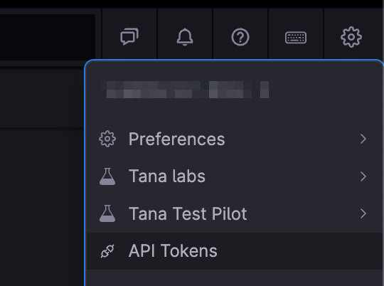
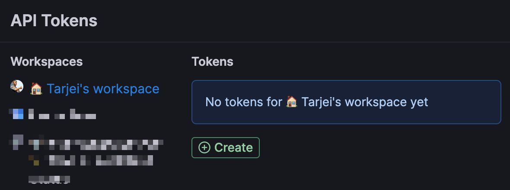
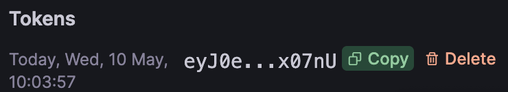
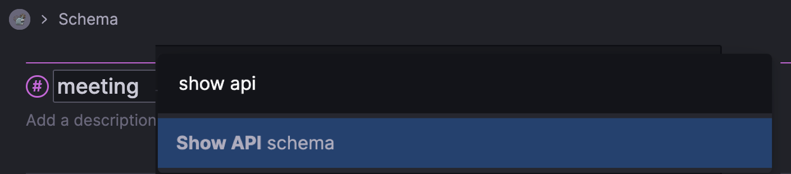

This project has a basic client for Tana's Input API and example scripts.

# Tana Input API

The Tana Input API is an API that allows you to add data (including tags) to Tana Graphs.
(APIs for reading from Tana Graphs are currently not available but on our roadmap)

With this API, you can:
- Send nodes, including children, to Tana
- Create or add existing tags and fields to the nodes being sent

## Restrictions
Please note that the API currently has the following restrictions:

- One call per second per token
- Max 100 nodes created per call
- Max 5000 chars in one request

Let us know in our Slack-community if you are hitting these limits, as we have set them at a rather arbitrary number for now.

## Before you start
You need an API token to work with the Tana Input API.
Tokens are assigned per workspace and can be generated in the Tana Client:

1. In the upper right corner of your Tana client, choose API Tokens<br>



2. Select which workspace you want to create a token for, and click create token:<br>



3. Click Copy to copy the token you just created<br>



# 👨‍💻 How to use this client

The client uses node-fetch, but native fetch can be used from Node 17.5 with `--experimental-fetch`

Install the deps with `yarn install`, then see below for the examples

## Using existing tags

This can be found, including generated code, on the Supertag by running the command “Show API schema” on the title of the tag in the tag config or in the Schema section:

<br>


A typical schema looks like this:<br>
```
type Node = {
  name: string;
  description?: string;
  supertags: [{
    /* meeting */
    id: 'MaaJRCypzJ'
  }];
  children: [
    {
      /* Date */
      type: 'field';
      attributeId: 'iKQAQN38Vx';
      children: [{
        dataType: 'date';
        name: string;
      }];
    },
  ];
};
```

And comes with a payload example:
```
{
  "nodes": [
    {
      "name": "New node",
      "supertags": [
        {
          "id": "MaaJRCypzJ"
        }
      ],
      "children": [
        {
          "type": "field",
          "attributeId": "iKQAQN38Vx",
          "children": [
            {
              "dataType": "date",
              "name": "2023-05-10T08:25:59.059Z"
            }
          ]
        },
        {
          "name": "Child node"
        }
      ]
    }
  ]
}
```


## Creating fields & tags
To create a new field definition you create a node with the supertag set to `SYS_T02`. You'll likely want to target the Schema-node, which would be `SCHEMA`, but you are free to place tags elsewhere as well. This might be useful when creating templates for example

```
{
  targetNodeId: 'SCHEMA',
  nodes: [
    {
      name: 'Author',
      description: 'Who wrote the book?',
      supertags: [{id:'SYS_T02'}]
    },
    {
      name: 'My rating',
      description: 'How was it?',
      supertags: [{id:'SYS_T02'}]
    }
  ]
}
```

To create a tag, set the supertag to `SYS_T01`:

```
{
  targetNodeId: 'SCHEMA',
  nodes: [
    {
      name: 'Book',
      description: 'A supertag for my books',
      supertags: [{id:'SYS_T01'}],
      children: []
    }
  ]
}
```

## Creating nodes
Nodes will be placed in Library by default, unless targetNodeId is specified

```
{
  nodes: [
    {
      name: 'The Hobbit',
      description: 'A book by J.R.R. Tolkien',
      supertags: [{id:'MyTagId'}],
      children: []
    }
  ]
}
```

## Targeting Tana standard nodes
You can target the Tana standard nodes *Schema* (where you typically will put the Supertags and Fields you create) and the *Inbox*.

Use these methods in the TanaAPIClient to get the ID for these nodes:
tanaAPIHelper.schemaNodeId() 
tanaAPIHelper.inboxNodeId()

We currently don't support targeting the Today-node 

## Example:Books

This example shows how we can create new fields, and then a new tag using those fields. We then create a few books using the tag, and add some extra content to the books afterwards.

`TANA_TOKEN=token yarn run example:books`

## Example:Upload

This example is a basic uploader for `m4a` audio-files from some specified directory to the
Tana inbox.  It creates a file `tana-upload-state.json` to keep track of what's already uploaded.

`TANA_TOKEN=token yarn run example:upload ~/Recordings/`

# Current limitations

Rate limiting:
- One call per second per token
- Max 100 nodes created per call
- Max 5000 chars in one request

Other limitations:
- You cannot target a relative Today-node
- To add tags/fields, you’ll have to know the IDs of the Supertag. To get it, run the command “Show API schema” on a tag
- The payload is currently capped at 5K. Let us know if this is too low (and why)
- There’s a new endpoint for the updated API
- You cannot send a checkbox as a child to a normal node
- We don’t support the initialization function
- We don’t support child templates

# ✍️ Contributing

Feedback, PRs and suggestions for improvements will be highly appreciated. 
Make sure you read our [Code of Conduct](CODE_OF_CONDUCT.md)
